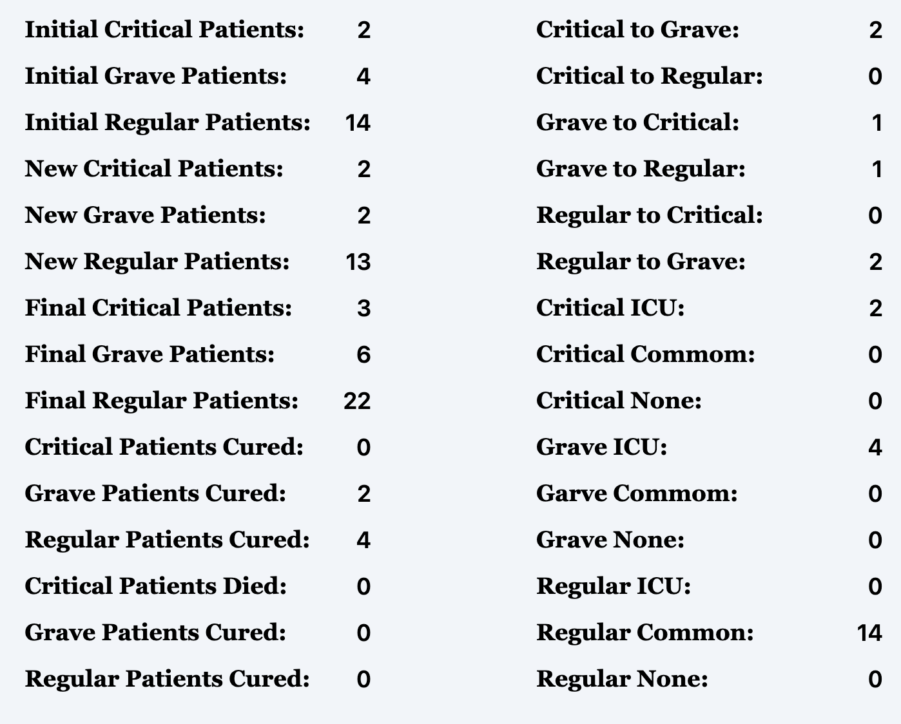
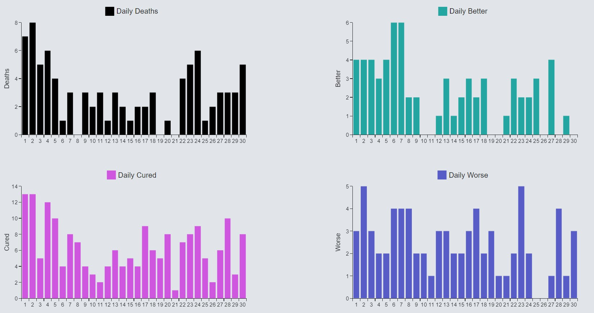

# Reporte Tecnico

## Integrantes

- Karen Dianelis Cantero López C411
- Luis Alejandro Rodríguez Otero C411
- Sebastián Suárez Gómez C411
- Héctor Miguel Rodríguez Sosa C411
- Javier Rodríguez Sánchez C411

## 1. Introduccion

La gestión eficiente de los recursos hospitalarios es fundamental para garantizar resultados óptimos para los pacientes,
especialmente en la asignación de camas de cuidados intensivos. Este proyecto tiene como objetivo simular la dinámica de
un entorno hospitalario, centrándose en el flujo de pacientes, la progresión de la enfermedad y el impacto de la
asignación de camas en los resultados de los pacientes. Mediante un modelo computacional, esta simulación proporciona
una herramienta valiosa para comprender la compleja interacción de factores dentro de un entorno hospitalario.

Específicamente, la simulación logra los siguientes objetivos:

- Modelado de la Dinámica de Pacientes: Se generan pacientes con diferentes edades y estados de salud iniciales, y sus
  condiciones pueden evolucionar con el tiempo, imitando la progresión de enfermedades del mundo real.
- Asignación de Recursos: La simulación incorpora un número limitado de camas UCI y comunes, lo que requiere un enfoque
  estratégico para la asignación de camas.
- Perspectivas de Apoyo a la Toma de Decisiones: Al realizar un seguimiento de métricas clave como la ocupación de
  camas, las tasas de curación, las tasas de mortalidad y las transiciones de pacientes, la simulación revelará posibles
  cuellos de botella e informará las estrategias para mejorar la eficiencia del hospital en diferentes escenarios.
- Este proyecto tiene el potencial de proporcionar información valiosa que podría ayudar a los proveedores de atención
  médica a tomar decisiones basadas en datos sobre la asignación de recursos y las estrategias de atención al paciente.

## 2. Metodología

### 2.1. Preparación de la simulación

La simulación se basa en un modelo de eventos discretos, que se ejecuta en un bucle de tiempo. En cada paso de tiempo,
los eventos ocurren en un orden específico, y el estado del sistema se actualiza en consecuencia. La simulación se
inicializa con un número de pacientes y camas, y se ejecuta durante un número de pasos de tiempo especificado.

### 2.2. Modelado de la Dinámica de Pacientes

Los pacientes se generan con diferentes edades y estados de salud iniciales, y su estado de salud puede evolucionar con
el tiempo. Como se generan estas estadísticas principales es con una distribución uniforme. Se escoge un valor de una
lista de posibles valores con una probabilidad asociada:

```python
import numpy as np

age = np.random.choice(["young_adult", "adult", "senior"], p=[0.3, 0.4, 0.3])
status = np.random.choice(["grave", "critical", "regular"], p=[0.3, 0.2, 0.5])
```

Los pacientes pueden ser admitidos en el hospital, ser tratados en una cama UCI o común, o ser dados de alta del
hospital. La progresión de la enfermedad y la recuperación de los pacientes se modelan con una serie de parámetros
estocásticos. Lo siguiente es un ejemplo de como se modela la interaccion de un paciente con el hospital:

```python
class Patient:

  ### ....

  def interact(self):
    import random

    if self.bed_assigned is None:
      return
    x = random.random()

    if self.status == 'critical' and self.bed_assigned.typee == 'ICU':
      if x <= 0.2:
        self.is_cured = True
      elif 0.2 < x <= 0.5:
        self.is_dead = True
      elif 0.5 < x <= 0.8:
        self.status = 'grave'

    elif self.status == 'critical' and self.bed_assigned.typee == 'common':
      if x <= 0.1:
        self.is_cured = True
      elif 0.1 < x <= 0.5:
        self.is_dead = True
      elif 0.5 < x <= 0.7:
        self.status = 'grave'
      elif 0.7 < x <= 0.75:
        self.status = 'regular'

    ### ....

```

### 2.3. Asignación de Recursos

El hospital tiene un número limitado de camas UCI y comunes, y los pacientes deben ser asignados a estas camas según su
estado de salud. La asignación de camas se realiza de manera estratégica para maximizar la eficiencia del hospital y
mejorar los resultados de los pacientes. Primero se crea una matriz de "costos", la cual es una matriz de `|p|` x `|b|`,
donde `|p|` es la cantidad de pacientes y `|b|` es la cantidad de camas disponibles, y `matriz[i,j]` representa el costo de
asignar el paciente i a la cama j. Este costo es una función predefinida que usa el tipo de cama, el estado y la edad
de los pacientes para tomar su decision.

Una vez que se ha creado la matriz de costos, se utiliza el algoritmo de asignación húngaro, también conocido como el
algoritmo de asignación óptima, para asignar los pacientes a las camas de manera que se minimice el costo total. Este
algoritmo garantiza que se encontrará la asignación óptima. Al final de la asignación los pacientes que no fueron
asignados a una cama se les asigna `None`.

```python
from scipy.optimize import linear_sum_assignment


def assign_beds(self):
  assignments = []
  row_ind, col_ind = linear_sum_assignment(self.costs)
  for i in range(len(row_ind)):
    self.patients[row_ind[i]].bed_assigned = self.beds[col_ind[i]]
    assignment = f'{str(self.patients[row_ind[i]])} -> {str(self.beds[col_ind[i]])}'
    assignments.append(assignment)

  # set to None the ones not assigned
  for i in range(len(self.patients)):
    if i not in row_ind:
      self.patients[i].bed_assigned = None

  return assignments
```

Al final del dia pueden llegar al hospital nuevos pacientes, estos pacientes son generados de la misma forma (con
distribución uniforme) que los pacientes iniciales a la simulación

## 3. Resultados

La simulación proporciona una visión detallada de la dinámica del hospital, incluida la ocupación de camas, las tasas de
curación y las tasas de mortalidad. Al realizar un seguimiento de estas métricas clave, la simulación puede revelar
posibles cuellos de botella y ayudar a los administradores del hospital a identificar estrategias para mejorar la
eficiencia del hospital.

A continuación mostramos un tabla con la media, la mediana y la varianza de los datos generados por la simulación en una
de sus iteraciones:

| Metrica                   | Media              | Mediana | Varianza            |
|---------------------------|--------------------|---------|---------------------|
| initial_critical_patients | 4.222222222222222  | 4.0     | 5.506172839506173   |
| initial_grave_patients    | 6.37037037037037   | 5.0     | 8.381344307270233   |
| initial_regular_patients  | 11.555555555555555 | 13.0    | 24.691358024691358  |
| new_critical_patients     | 2.1481481481481484 | 1.0     | 3.4595336076817556  |
| new_grave_patients        | 2.4444444444444446 | 2.0     | 3.0617283950617282  |
| new_regular_patients      | 5.037037037037037  | 5.0     | 16.776406035665296  |
| final_critical_patients   | 4.222222222222222  | 4.0     | 5.506172839506172   |
| final_grave_patients      | 6.333333333333333  | 5.0     | 8.222222222222221   |
| final_regular_patients    | 11.296296296296296 | 12.0    | 25.68998628257887   |
| critical_patients_cured   | 0.7407407407407407 | 1.0     | 0.6364883401920439  |
| grave_patients_cured      | 2.4074074074074074 | 2.0     | 2.241426611796982   |
| regular_patients_cured    | 3.5185185185185186 | 4.0     | 3.4348422496570645  |
| critical_patients_died    | 1.4074074074074074 | 1.0     | 1.8710562414266116  |
| grave_patients_died       | 0.8518518518518519 | 1.0     | 1.2373113854595335  |
| regular_patients_died     | 1.0                | 1.0     | 0.8148148148148148  |
| critical_to_grave         | 1.2962962962962963 | 1.0     | 1.1714677640603566  |
| critical_to_regular       | 0.0                | 0.0     | 0.0                 |
| grave_to_critical         | 0.8888888888888888 | 1.0     | 0.7654320987654322  |
| grave_to_regular          | 1.3333333333333333 | 1.0     | 0.9629629629629629  |
| regular_to_critical       | 0.4074074074074074 | 0.0     | 0.38957475994513024 |
| regular_to_grave          | 1.7037037037037037 | 2.0     | 2.5048010973936896  |
| critical_ICU              | 3.074074074074074  | 3.0     | 2.2167352537722906  |
| critical_common           | 1.1481481481481481 | 0.0     | 3.385459533607683   |
| critical_none             | 0.0                | 0.0     | 0.0                 |
| grave_ICU                 | 5.407407407407407  | 5.0     | 2.6117969821673523  |
| grave_common              | 0.9629629629629629 | 0.0     | 2.850480109739369   |
| grave_none                | 0.0                | 0.0     | 0.0                 |
| regular_ICU               | 0.0                | 0.0     | 0.0                 |
| regular_common            | 11.555555555555555 | 13.0    | 24.691358024691358  |
| regular_none              | 0.0                | 0.0     | 0.0                 |

Además esto es un sample de un día al azar de una iteración de la simulación:



Y esto es una gráfica de 4 métricas específicas de una iteración completa de la simulación:




## 4. Conclusiones

La simulación proporciona una visión detallada de la dinámica del hospital, incluida la ocupación de camas, las tasas de
curación y las tasas de mortalidad. Al realizar un seguimiento de estas métricas clave, la simulación puede revelar
posibles cuellos de botella y ayudar a los administradores del hospital a identificar estrategias para mejorar la
eficiencia del hospital.
